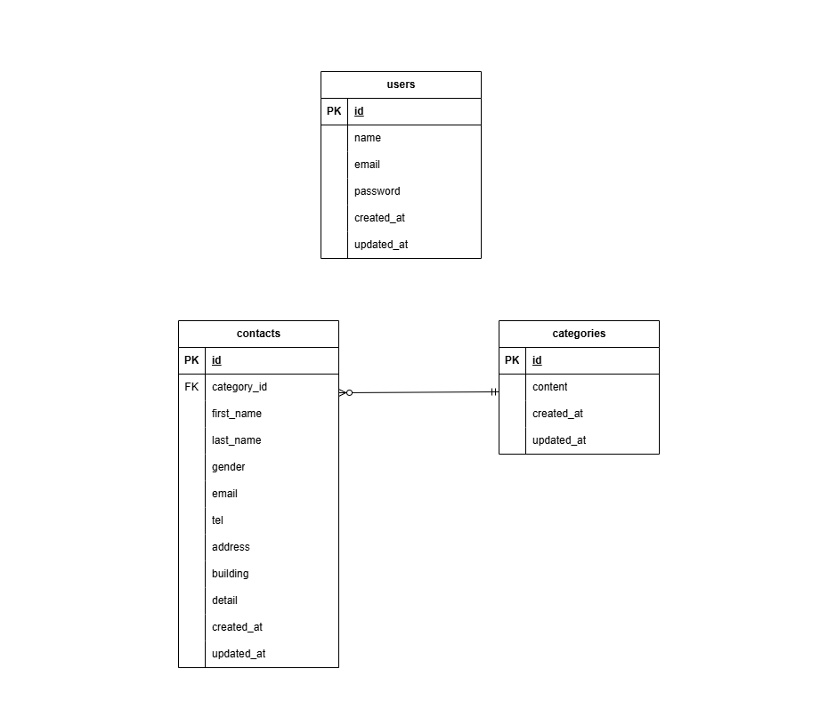

# お問い合わせフォーム

## アプリケーション概要
- ユーザー登録・ログイン（Fortify使用）
- 管理者画面での内容確認・削除・検索・CSVエクスポート機能
- お問い合わせフォーム（確認画面・サンクス画面あり）
- バリデーション付きのフォーム処理

## 主な機能
- ユーザー認証（新規登録・ログイン・ログアウト）
- 管理者による検索・一覧・詳細・削除・エクスポート
- カテゴリによる分類
- お問い合わせの投稿と確認

## 環境構築
Dockerセットアップ
1. `git clone git@github.com:masa-nao/confirmation-test.git`
2. クローン後、リポジトリを配置したい任意のディレクトリに移動し、以下のコマンドを実行
3. `docker-compose up -d --build`

＊ コンテナ作成ができない場合、`Dockerfile` のPHPのバージョンの記述を `FROM php:8.1-fpm` と編集して再度ビルドしてください。

＊ MySQLは、OSによって起動しない場合があるので、それぞれのPCに合わせて `docker-compose.yml` ファイルを編集してください。

＊ クローン後、Laravel本体は `./src` ディレクトリに展開されています。

Laravel環境構築
- `docker-compose exec php bash`
- `composer install`
- `cp .env.example .env`（複製した `.env` ファイルの環境変数を変更）
- `php artisan key:generate`

マイグレーション
- 各モデルとマイグレーションファイルの記述の確認（以下の記述があるか確認）
```
# Contact.php
protected $fillable = [
        'last_name',
        'first_name',
        'gender',
        'email',
        'tel',
        'address',
        'building',
        'category_id',
        'detail',
    ];


# Category.php
protected $fillable = ['content'];
```
```
# xxxx_create_contacts_table.php
public function up()
{
    Schema::create('contacts', function (Blueprint $table) {
        $table->id();
        $table->foreignId('category_id')->constrained()->cascadeOnDelete();
        $table->string('first_name', 255);
        $table->string('last_name', 255);
        $table->tinyInteger('gender');
        $table->string('email', 255);
        $table->string('tel', 255);
        $table->string('address', 255);
        $table->string('building', 255)->nullable();
        $table->text('detail');
        $table->timestamps();
    });
}


# xxxx_create_categories_table.php
public function up()
{
    Schema::create('categories', function (Blueprint $table) {
        $table->id();
        $table->string('content');
        $table->timestamps();
    });
}
```
- 各モデルとマイグレーションファイルの記述が確認できたら以下のコマンドでマイグレーションを実行
- `php artisan migrate`
- phpMyAdminでテーブルが作成されているか確認する

シーディング
- ファクトリを使用し、contactsテーブルにダミーデータを35件作成
- ファクトリにモデルの読み込みとdifinitionメソッドの記述の確認（以下の記述があるか確認）
```
# ContactFactory.php
use App\Models\Contact;
use App\Models\Category;

protected $model = Contact::class;

public function definition()
{
    return [
        'category_id' => Category::inRandomOrder()->value('id') ?? 1,
        'first_name'  => $this->faker->firstName,
        'last_name'   => $this->faker->lastName,
        'gender'      => $this->faker->numberBetween(1, 3),
        'email'       => $this->faker->unique()->safeEmail,
        'tel'         => $this->faker->numerify('0##########'),
        'address'     => $this->faker->prefecture . $this->faker->city . $this->faker->streetAddress,
        'building'    => $this->faker->optional()->secondaryAddress,
        'detail'      => $this->faker->realText(60),
    ];
}
```
- 次にシーダーファイルのrunメソッドの記述の確認（以下の記述があるか確認）
```
# ContactsTableSeeder.php
use App\Models\Contact;

public function run()
    {
        Contact::factory()->count(35)->create();
    }
```
- categoriesテーブル(お問い合わせの種類)のダミーデータはシーダーファイルを使用し、以下5件のダミーデータを作成（以下の記述があるか確認）
```
# CategoriesTableSeeder.php
use App\Models\Category;

public function run()
{
    $contents = [
        '商品のお届けについて',
        '商品の交換について',
        '商品トラブル',
        'ショップへのお問い合わせ',
        'その他'
    ];

    foreach ($contents as $content) {
        Category::create(['content' => $content]);
    }
}
```
- `DatabaseSeeder.php` のrunメソッドに各シーダーファイルの呼び出しを設定（以下の記述があるか確認）
```
# DatabaseSeeder.php
public function run()
{
    $this->call([
        CategoriesTableSeeder::class,
        ContactsTableSeeder::class
    ]);
}
```
- ファクトリとシーダーファイルの記述が確認できたら以下のコマンドでシーディングを実行
- `php artisan db:seed`
- phpMyAdminでテーブルにデータが挿入されているか確認する

## Fortify導入
＊ すでにFortifyに関するファイルがあり記述済みなら、このFortify導入の工程は飛ばしてよい
- PHPコンテナ内で、Fortifyでの認証に使用するマイグレーションファイルの作成とマイグレーションを実行
- `composer require laravel/fortify`
- `php artisan vendor:publish --provider="Laravel\Fortify\FortifyServiceProvider"`
- `php artisan migrate`
- config/app.phpファイルの以下２点の修正（ローカルの変更、サービスプロバイダの追加）
```
'local' => 'ja',

'providers' => [
// 中略
  App\Providers\RouteServiceProvider::class,
+ App\Providers\FortifyServiceProvider::class,
```
- 上記はアプリケーションの言語設定を英語enから日本語jaに変更し、providersにFortifyを登録することで、Fortifyを起動できるようにしている
- 次に、app/Providers/ディレクトリ以下にある `FortifyServiceProvider.php` のbootメソッドの修正
```
# FortifyServiceProvider.php
public function boot(): void
{
    Fortify::createUsersUsing(CreateNewUser::class);

    Fortify::registerView(function () {
        return view('register');
    });

    Fortify::loginView(function () {
        return view('login');
    });

    RateLimiter::for('login', function (Request $request) {
       $email = (string) $request->email;

        return Limit::perMinute(10)->by($email . $request->ip());
    });
}
```
- `RouteServiceProvider.php` のログイン後のリダイレクト先が/になるよう修正
```
# RouteServiceProvider.php
public const HOME = '/';
```
- Fortifyのエラー文を日本語表示にするために、PHPコンテナ内で以下のコマンドを実行
- `composer require laravel-lang/lang:~7.0 --dev`
- `cp -r ./vendor/laravel-lang/lang/src/ja ./resources/lang/`
- resource/langディレクトリ以下に `ja` ディレクトリが作成されていれば成功
- 任意のコントローラとビューを作成し、認証に必要な機能を作成していく

## 使用技術(実行環境)
フロントエンド
- HTML5
- CSS3

バックエンド
- PHP 7.4.9（`php -v` で確認）
- Laravel 8.83.8（`php artisan --version` で確認）

その他
- Docker / Docker Compose
- MySQL 8.0.26
- Nginx 1.21.1
- phpMyAdmin
- Fortify（Laravel公式のユーザー認証機能パッケージ）

## ER図
以下は本アプリケーションにおけるデータベース設計（ER図）です。


## URL
データベース確認
- phpMyAdmin：http://localhost:8080/

アプリ環境
- フォーム入力：http://localhost/
- 入力確認画面：http://localhost/confirm
- サンクス画面：http://localhost/thanks
- 管理画面：http://localhost/admin
- 新規登録画面：http://localhost/register
- ログイン画面：http://localhost/login
